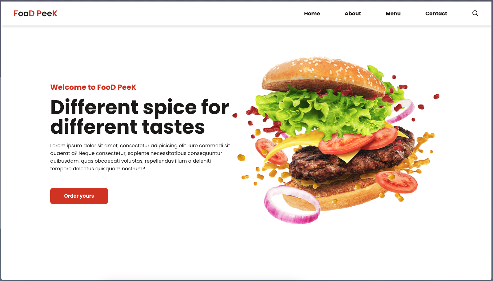

# FooD PeeK - A Simple Landing Page

FooD PeeK is a sleek and engaging landing page project that highlights essential concepts in web development. It combines semantic HTML, well-structured CSS, and basic DOM manipulation with JavaScript to create a responsive and visually pleasing user experience.

## Features

- Semantic HTML for improved accessibility and SEO.
- Custom CSS for stylish and responsive design.
- JavaScript integration for dynamic interactivity (menu toggle functionality).
- Mobile-first approach for seamless display across devices.
- Modern fonts and icons for a polished visual aesthetic.

## Technologies Used

- **HTML**: Semantic structure and layout.
- **CSS**: Custom styles and responsive design principles.
- **JavaScript**: Interactive elements and DOM manipulation.
- **Google Fonts**: "Poppins" font for a modern feel.
- **Boxicons**: Icon library for enhanced design.

## Installation

1. Clone this repository:
   ```bash
   git clone https://github.com/vmadalosso/simple-landing-page.git
2. Clone this repository:
   ```bash
   cd simple-landing-page
3. Open ``index.html`` in your browser to view the landing page.

## Usage

- The navigation menu dynamically adjusts to various screen sizes, ensuring usability on mobile devices.
- The "Order yours" call-to-action button provides a placeholder for integrating future functionality.

## Preview




## License

This project is open-source and available under the MIT License.